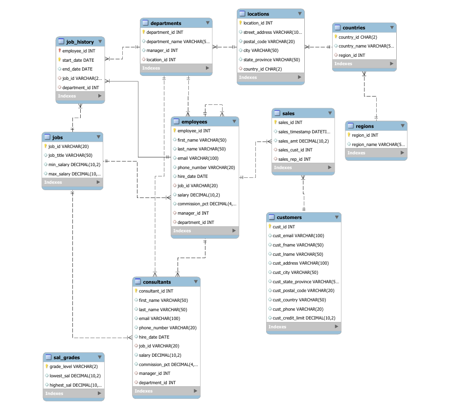

# Epic 3.2 Employee Management System SQL


## Project Overview
This project demonstrates SQL skills for managing an Employee Management System database. It includes database creation, table design, data manipulation, and complex queries.

## Database Structure
The `company` database contains 11 tables:

| Table | Description |
|-------|-------------|
| regions | Geographic regions |
| countries | Countries with region references |
| locations | Office locations with addresses |
| departments | Company departments |
| employees | Employee information |
| jobs | Job titles and salary ranges |
| job_history | Employee job change history |
| sal_grades | Salary grade levels |
| consultants | Consultant information |
| customers | Customer information |
| sales | Sales transactions |

## Entity Relationship Diagram


## Files Included
| File | Description |
|------|-------------|
| Sprint3_Week2_SQL_Queries.sql | All SQL queries for user stories |
| Company_ERD.png | Entity Relationship Diagram |
| README.md | Project documentation |

## User Stories Completed

### Main Stories (9/9)
1. **Highest Paid Employee** - Query to display details of the highest paid employee including name, salary, job ID, department, city, and country
2. **Employees Still Listed as Consultants** - Find employees who appear in both employees and consultants tables
3. **Customer Sales Information** - Comprehensive customer report with sales aggregations
4. **Department Managers** - Display managers responsible for departments with location details
5. **Employees Earning >= Managers** - Find employees earning same or more than their managers
6. **Employees Returned to Original Job** - Identify employees who returned to a previous job
7. **Non-Managers Earning More Than Managers** - Find non-managers with higher salaries than some managers
8. **Employee Count by Region** - Count employees per geographic region
9. **Transaction Updates** - Multiple UPDATE/DELETE/INSERT operations in a transaction

### Bonus Stories (4/4)
1. **Biggest Sale by Sales Rep** - Show each sales representative's largest sale with details
2. **Commissioned Employees Above Average** - Find commissioned employees with above-average total pay
3. **Sales Manager Compensation** - Calculate total compensation for sales managers
4. **Customer Largest Sale Details** - Show largest sale for each customer with full details

## SQL Concepts Demonstrated
- **DDL**: CREATE DATABASE, CREATE TABLE
- **DML**: INSERT, UPDATE, DELETE
- **Queries**: SELECT with multiple JOINs
- **Joins**: INNER JOIN, LEFT JOIN, Self-joins
- **Subqueries**: Correlated and non-correlated subqueries
- **Aggregations**: SUM, AVG, MAX, COUNT
- **Grouping**: GROUP BY, HAVING
- **Transactions**: START TRANSACTION, COMMIT
- **Variables**: Using @ variables to avoid hard-coding

## How to Run
1. Open MySQL Workbench
2. Connect to your local MySQL server
3. Open the file `Sprint3_Week2_SQL_Queries.sql`
4. Execute the queries using the lightning bolt icon (⚡)


## Add your files

- [ ] [Create](https://docs.gitlab.com/ee/user/project/repository/web_editor.html#create-a-file) or [upload](https://docs.gitlab.com/ee/user/project/repository/web_editor.html#upload-a-file) files
- [ ] [Add files using the command line](https://docs.gitlab.com/ee/gitlab-basics/add-file.html#add-a-file-using-the-command-line) or push an existing Git repository with the following command:

```
cd existing_repo
git remote add origin https://git.fdmgroup.com/Gabriel.Gomes/epic-3.2-employee-management-system-sql.git
git branch -M main
git push -uf origin main
```

## Collaborate with your team

- [ ] [Invite team members and collaborators](https://docs.gitlab.com/ee/user/project/members/)
- [ ] [Create a new merge request](https://docs.gitlab.com/ee/user/project/merge_requests/creating_merge_requests.html)
- [ ] [Automatically close issues from merge requests](https://docs.gitlab.com/ee/user/project/issues/managing_issues.html#closing-issues-automatically)
- [ ] [Enable merge request approvals](https://docs.gitlab.com/ee/user/project/merge_requests/approvals/)
- [ ] [Set auto-merge](https://docs.gitlab.com/ee/user/project/merge_requests/merge_when_pipeline_succeeds.html)

## Test and Deploy

Use the built-in continuous integration in GitLab.

- [ ] [Get started with GitLab CI/CD](https://docs.gitlab.com/ee/ci/quick_start/index.html)
- [ ] [Analyze your code for known vulnerabilities with Static Application Security Testing (SAST)](https://docs.gitlab.com/ee/user/application_security/sast/)
- [ ] [Deploy to Kubernetes, Amazon EC2, or Amazon ECS using Auto Deploy](https://docs.gitlab.com/ee/topics/autodevops/requirements.html)
- [ ] [Use pull-based deployments for improved Kubernetes management](https://docs.gitlab.com/ee/user/clusters/agent/)
- [ ] [Set up protected environments](https://docs.gitlab.com/ee/ci/environments/protected_environments.html)

***
## License

This project is licensed under the MIT License - see the [LICENSE](LICENSE) file for details.

---

## Authors
- Gabriel Gomes  
  - GitLab: [Gabriel.Gomes](https://git.fdmgroup.com/Gabriel.Gomes)  
  - GitHub: [GabrielHumbertDev](https://github.com/GabrielHumbertDev)  
  - Email: Gabriel.Gomes@fdmgroup.com
- **FDM Group** - Initial development
- **Epic 3 Team** - Banking system implementation

---

## Acknowledgments

- FDM Group for project requirements and specifications
- Sprint 3 OOD4 for email alert requirements
- Jakarta Mail team for excellent email library
- JUnit and Mockito teams for testing frameworks

---

## Support

For questions or support:
- Create an issue in the GitHub repository
- Contact the development team
- Review documentation in the `docs/` folder

---

## Date
January 2025
